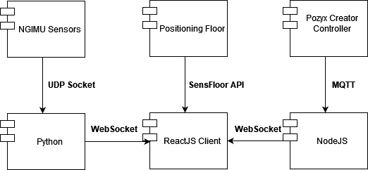

## Systems and Technology for e-Health

### Preview

### Architecture

## Prerequisites
* NodeJS 12.x or above
* Python 3.x

## Before Running
* Inside _pozyx_ folder run:
    `npm install`
* Inside _client_ folder run:
    `npm install`

### Run
Using separate command lines:
* Inside _pozyx_ folder run:
    `node index.js`
* Inside _ngimu_ folder run:
    `python merge.py`
* Inside _client_ folder run:
    `npm start`

